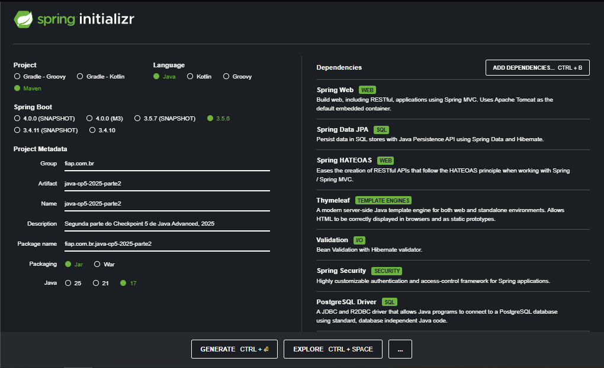
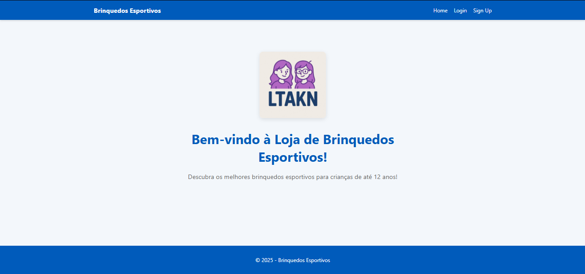
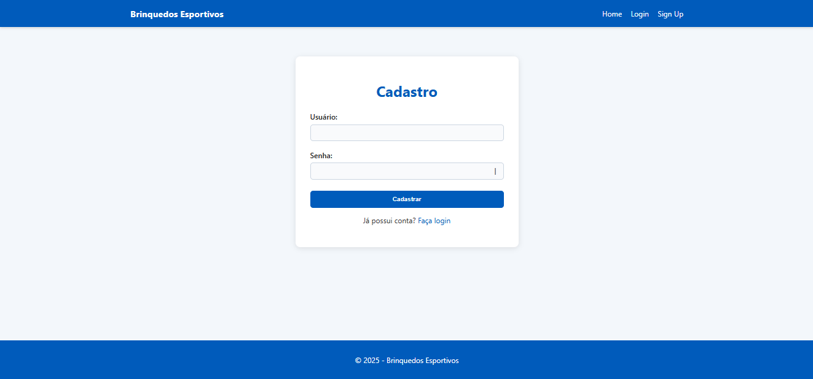
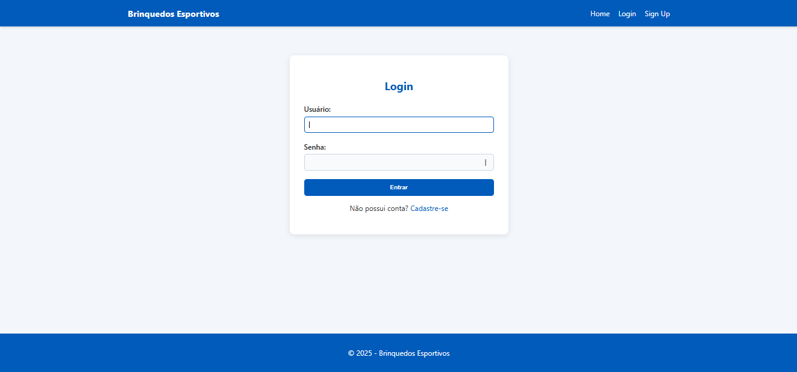
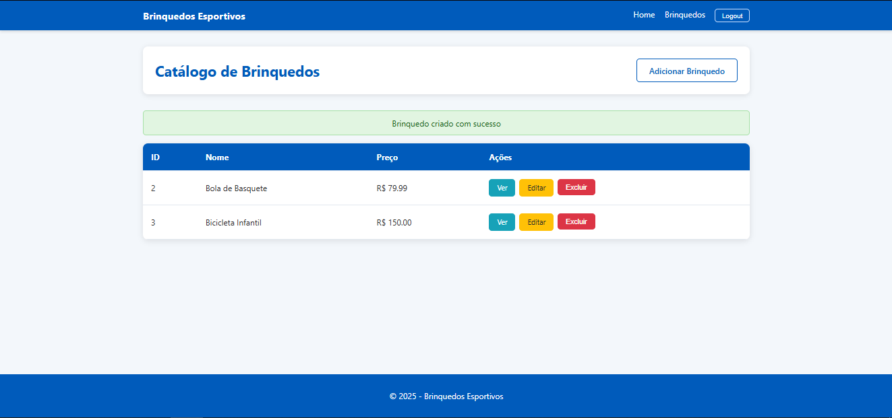
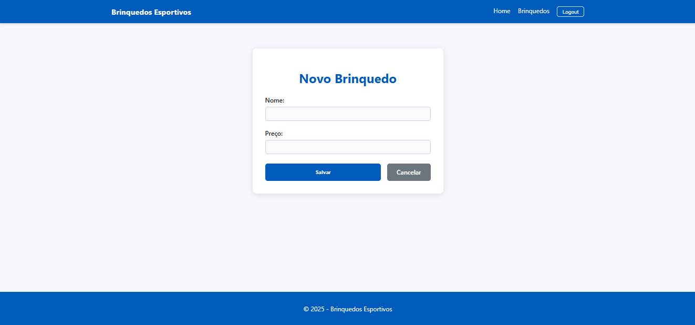
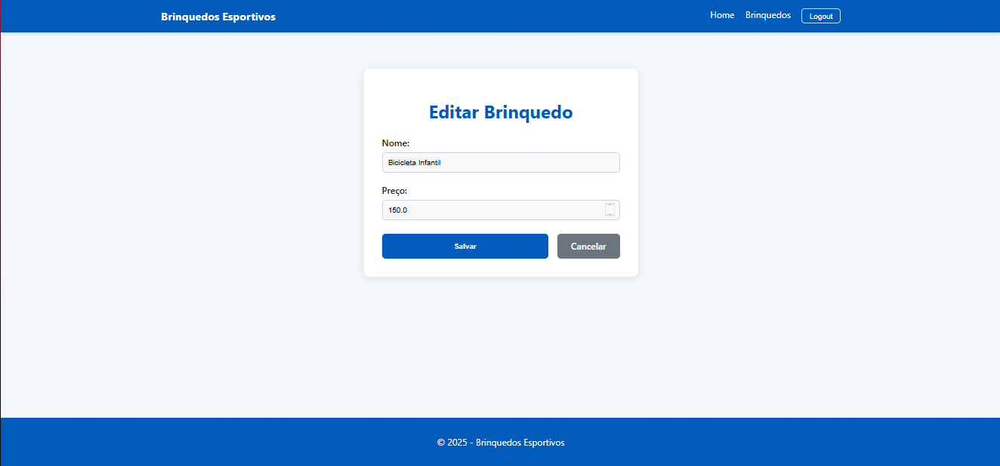
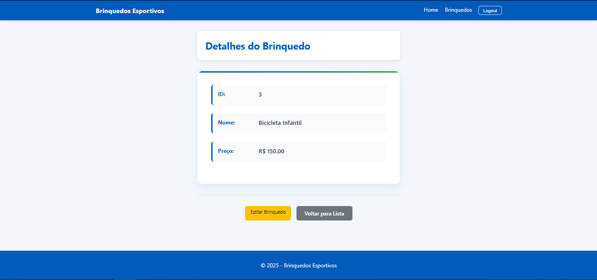

# Brinquedos - Checkpoint 5 (Parte 2 - Spring Security)

**Grupo:** LTAKN  
- Enzo Prado Soddano — RM557937  
- Lucas Resende Lima — RM556564  
- Vinicius Prates Altafini — RM556183  

---

## 📌 Descrição
Este projeto é a **Parte 2** do Checkpoint 5 de Java Advanced.

- **Spring Security** com autenticação e autorização
- **Sistema de login personalizado** com tela de cadastro (Sign Up)
- **Dois tipos de usuários** (USER e ADMIN) com diferentes acessos
- **PostgreSQL** como banco de dados
- **Interface web** usando Spring MVC + Thymeleaf
- **API REST** com HATEOAS
- **CRUD completo** de brinquedos esportivos
- **Validações** com Spring Validation
- **Deploy** em produção

---

## 🚀 Deploy / Entrega

- 🌐 **Projeto Live:**  
  [INSERIR_LINK_DEPLOY_AQUI]

- 📦 **Repositório GitHub:**  
  [https://github.com/DerBrasilianer/java-cp5-2025-parte2.git]

---

## 🛠️ Tecnologias

- **Java 17**
- **Spring Boot 3.5.4**
- **Spring Security 6**
- **Spring MVC + Thymeleaf**
- **Spring Data JPA**
- **Spring HATEOAS**
- **PostgreSQL**
- **Lombok**
- **Maven**
- **Bootstrap** (para interface web)

---

## ⚙️ Como rodar localmente

1. Clone o repositório:
   ```bash
   git clone [INSERIR_LINK_GITHUB_AQUI]
   cd brinquedos-revisao
   ```

2. Configure o banco de dados PostgreSQL no `application.yml`

3. Abra o projeto na sua IDE (IntelliJ, Eclipse ou VS Code com suporte a Java).  

4. Rode a aplicação a partir da classe principal do Spring Boot.  

5. A aplicação ficará disponível em:  
   [http://localhost:8081](http://localhost:8081)

---

## 🔐 Funcionalidades de Segurança

### Sistema de Autenticação
- **Tela de login personalizada** (`/login`)
- **Tela de cadastro** (`/signup`) para novos usuários
- **Dois tipos de roles**: `USER` e `ADMIN`
- **Password encoder** com BCrypt
- **Autorização baseada em roles** para diferentes endpoints

### Acessos por Tipo de Usuário
- **Usuários não autenticados**: Acesso apenas à página inicial e telas de login/cadastro
- **Usuários USER**: Acesso completo ao CRUD de brinquedos
- **Usuários ADMIN**: Acesso a recursos administrativos (`/admin/**`)

---

## 🗃️ Estrutura do Banco de Dados

### Tabela: `TDS_TB_Usuarios`
- `id` (PK, auto increment)
- `username` (unique, not null)
- `password` (criptografada)
- `role` (USER/ADMIN)
- `enabled` (boolean)

### Tabela: `TDS_TB_Brinquedos`
- `id` (PK, auto increment)
- `nome` (not null)
- `preco` (not null, positive)

---

## 📡 Endpoints Principais

### Web MVC (Thymeleaf)
- `GET /` - Página inicial
- `GET /login` - Tela de login
- `GET /signup` - Tela de cadastro
- `GET /brinquedos/web` - Lista de brinquedos (web)
- `GET /brinquedos/web/new` - Formulário de criação
- `GET /brinquedos/web/{id}` - Detalhes do brinquedo
- `GET /brinquedos/web/{id}/edit` - Formulário de edição

### API REST (JSON)
- `GET /brinquedos` - Lista todos (HATEOAS)
- `GET /brinquedos/{id}` - Busca por ID
- `POST /brinquedos` - Cria novo brinquedo
- `PUT /brinquedos/{id}` - Atualização completa
- `PATCH /brinquedos/{id}` - Atualização parcial
- `DELETE /brinquedos/{id}` - Exclui brinquedo

---

## 🔧 Configuração Spring Security

### SecurityConfig
- CSRF desabilitado para APIs
- Rotas públicas: `/`, `/login`, `/signup`, `/css/**`, `/js/**`
- Rotas administrativas: `/admin/**` (apenas ADMIN)
- Rotas autenticadas: `/brinquedos/**`
- Login personalizado em `/login`
- Logout configurado
- Suporte a HTTP Basic Auth para APIs

### CustomUserDetailsService
- Implementação customizada do UserDetailsService
- Integração com UserRepository
- Suporte a roles e status de usuário (enabled/disabled)

---

## 🎯 IDE Utilizado

**IntelliJ IDEA** - Ambiente de desenvolvimento principal

---

## 📸 Prints de Tela

* **Spring Initializr**


* **Página Inicial (Landing Page)**


* **Tela de Cadastro (Sign Up)**


* **Tela de Login**


* **Lista de Brinquedos (após login)**


* **Adicionar Brinquedo (CREATE)**


* **Editar Brinquedo (UPDATE)**


* **Detalhes do Brinquedo**
